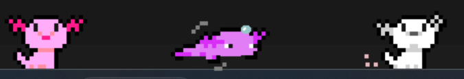

# desktop-pet

  

Download link: [Desktop pet-1-win64.msi](https://github.com/Eileenert/desktop-pet/blob/master/Desktop%20pet-1-win64.msi)
### Introduction

A desktop pet is a virtual animal that will wander around the taskbar of
the computer. The best known are the [*Shimeji*](https://shimejis.xyz/) or the *desktop goose*
inspired by the game [*Untitled Goose*](https://goose.game/).

My pet is a very cute axolotl. I was inspired by this [picture](https://pbs.twimg.com/media/EzZm4pXVoAQJSw-.jpg:large), to create the gif on
[*Piskel*](https://www.piskelapp.com/).

I chose this topic because I always wanted to make a desktop pet myself, my own
custom pet.

I used the Python programming language.

The modules to download are listed in the requirements.txt file with their version.

### Animations :

* normal
  * frames : 3
  * fps : 1

* sleep → waking up
  * frames : 10
  * fps : 3

* normal → sleep
  * frames : 8
  * fps : 3

* walk (right and left)
  * frames : 3
  * fps : 2 

* sleep
  * frames : 5
  * fps : 2

* eat
  * frames : 8
  *  fps: 5

* refusal
  * frames : 4
  * fps : 3

* happy
  * frames : 4
  * fps: 3

* ghost
  * frames : 5
  * fps : 4

* swim
  * frames : 5
  * fps : 3

* angry
  * frames : 5
  * fps : 2

“bonus”:
* mini-game
* interact with windows

Unfortunately, I haven't had time to do a bonus yet.

### Code explanation
coming soon...

### possible improvements
I can still improve a lot of things.
I can add colors, a death animation, create others animals that aren't axolotls. I can add mini-games or windows interactions.
Also, I could create a test file like for example with unittest.
